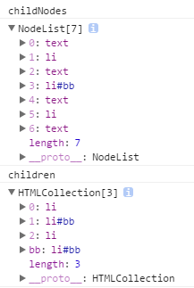
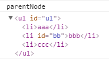
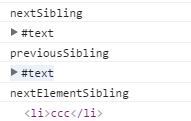
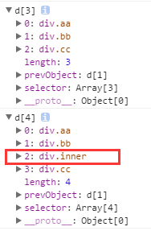

## DOM节点操作总结

<!-- more -->

### 原生js操作DOM节点方法

* 1、appendChild(node) // 向childNode末尾插入一个节点node
* 2、insertBefore(node, targetNode) // 向targeNode之前插入节点node
* 3、replaceChild(newNode, oldNode) // newNode替换节点oldNode
* 4、removeChild(node) // 移除父节点的某个子节点

以上四个方法操作的都是某个节点的子节点。例子如下：
```html
<!-- html -->

<ul id="ul">
    <li>aaa</li>
    <li>bbb</li>
    <li>ccc</li>
</ul>
```
```javascript
// js

var ul = document.getElementById('ul');
var newLi = document.createElement('li');
newLi.innerHTML = 'ddd';
ul.appendChild(newLi);    // ddd被插入到ul的最后一个元素后
ul.insertBefore(newLi, ul.children[1]);    // ddd被插入到目标节点bbb之前
ul.replaceChild(newLi, ul.children[1]);    // ddd替换掉目标节点bbb
ul.removeChild(ul.children[1]);    // bbb节点被移除
```
以上四个方法操作的都是某个节点的子节点。

### jQuery操作DOM节点方法

##### 1、插入节点
`append(), appendTo()`
```javascript
$(A).append(B);    // 把B后置到A中， A是原有节点，B是新节点
$(A).append(B);    // 把A后置到B中
```
`prepend(), prependTo()`
```javascript
$(A).prepend(B);    // 把B前置到A中
$(A).prepend(B);    // 把A前置到B中
```
`before(), insertBefore()`
```javascript
$(A).before(B);    // 把B插入到A前面
$(A).insertBefore(B);    // 把A插入到B前面
```
`after(), insertAfter()`
```javascript
$(A).after(B);    // 把B插入到A后
$(A).insertAfter(B);    // 把A插入到B后面
```
##### 2、删除节点
`remove(), empty()`
```javascript
$(ele).remove();    // 移除ele元素（内容和标签都删除）
$(ele).empty();    // 清空ele元素的内容（只清空内容，ele元素还在）
```
##### 3、替换节点
```javascript
$('<p>替换test</p>').replaceAll('#test');    // 用p替换id为test的元素
```


以上是常用的操作节点的方法，顺便再写一下选择查找元素的方法
***

### 原生js选择查找元素
#### 1、获得子节点
* childNodes    获得所有子节点集合
* children      获得所有子元素节点集合
* firstChild    获得第一个子节点
* lastChild     获得最后一个子节点

`childNodes`和`children`两者之间的区别在于，在chrome、Firefox、IE8+（不含IE8）等浏览器中，`childNodes`获得的是子节点集合，包含#text空白节点，来自由于书写规范使用的换行、缩进等空白字符；而`children`获取到的是子元素，不含上述空白节点。`firstChild`和`lastChild`也会获得#text空白文本节点。以下试验皆在chrome中。

```html
<!-- html -->

<ul id="ul">
    <li>first</li>
    <li id="second">second</li>
    <li>third</li>
</ul>
```
```javascript
// js

var ul = document.getElementById('ul');
console.log('childNodes')
console.log(ul.childNodes)
console.log('children')
console.log(ul.children)
```
控制台打印出的结果如下：

从上图可以看出，childNodes获得的集合中包含换行、缩进产生的空白。
IE9以下childNodes获得的集合中不包含#text节点
#### 2、获得父节点
* parentNode

```javascript
var second = document.getElementById('second');
console.log('parentNode')
console.log(second.parentNode)
```
控制台结果如下

#### 3、获得兄弟节点
* nextSibling        下一个兄弟节点
* previousSibling    上一个兄弟节点
* nextElementSibling 下一个兄弟元素节点

```javascript
console.log('nextSibling')
console.log(second.nextSibling)
console.log('nextElementSibling')
console.log(second.nextElementSibling)
console.log('previousSibling')
console.log(second.previousSibling)
```
控制台结果如下：

如图，`nextSibling`和`previousSibling`获得的是下一个节点，本文中second的下一个节点就是/n空白节点。
`nextElementSibling`获得的是元素节点。
### JQuery选择查找元素
#### 1、获得子元素
* children()
* find()

以上两个方法都是获得某元素的子元素，区别在于
`children()`如果这样写，括号中不加任何selector获得的是所有子元素的集合，若写成`children(selector)`则获得的是匹配的子元素集合。
`find()`获得当前元素后代中所有匹配的元素的集合。若没有参数则返回结果为空
还有很重要的一点区别通过下面的例子解释
```html
<!-- html -->

<div class="box">
    <div class="aa">啦啦啦</div>
    <div class="bb">啦啦啦啦<div class="inner">lllllll</div></div>
    <div class="cc">啦啦啦啦啦</div>
</div>
```
```javascript
// js

console.log($('.box').children('div'));
console.log($('.box').find('div'));
```
结果如下

`children()只会查找当前元素的下一层元素，而find()会查找当前元素下的所有元素`
#### 2、获得父元素
* parent()

#### 3、获得兄弟元素
* next() 当前元素的下一个同辈元素
* prev() 当前元素的上一个同辈元素
* siblings() 获得当前元素的同辈元素的集合

`siblings()`若没有参数则返回所有同辈元素的集合，若有参数则返回匹配的元素
